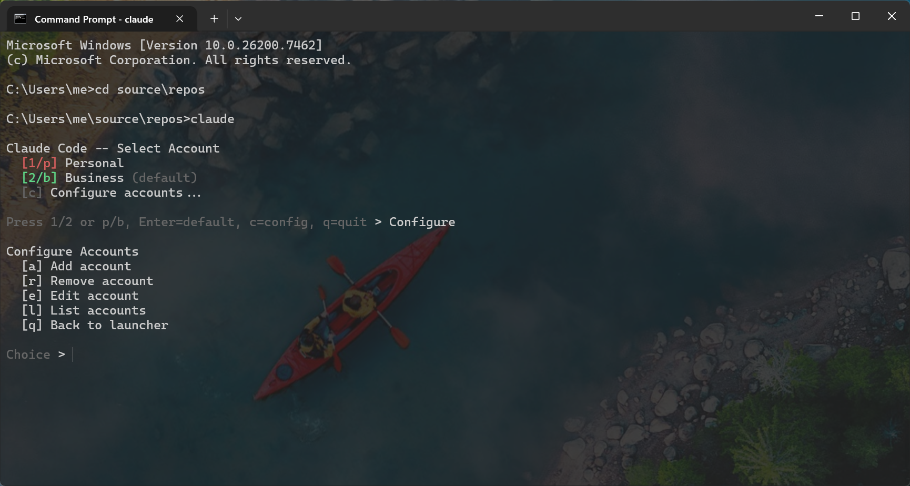
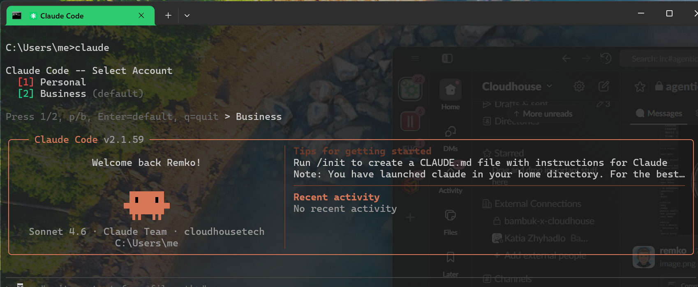

# multi-claude

Run multiple Claude Code accounts side-by-side with isolated configurations,
colored terminal tabs, and a cross-account access guard.

## Why?

Claude Code stores its configuration in `~/.claude`. If you have multiple
Anthropic accounts (personal, work, client projects...) you need separate
config directories, environment variables, and a way to pick which account
to launch. This tool handles all of that.

## What you get

- **TUI account picker** -- press a number or hotkey to choose an account
- **Windows Terminal tab colors** -- each account gets a distinct tab color
  via OSC 4;264 sequences
- **Cross-account guard hook** -- a PreToolUse hook that prevents Claude from
  reading or writing files in another account's config directory
- **Config-driven** -- add unlimited accounts via `~/.claude-launcher.json`
- **Works on Windows, macOS, and Linux**

## Screenshots

### Account picker with config menu


### Colored tab per account


## Quick start

```bash
git clone https://github.com/rweijnen/multi-claude.git
cd multi-claude
python setup.py
```

The setup script will:
1. Ask you for account names, labels, colors, and config directories
2. Write `~/.claude-launcher.json`
3. Create config directories for non-default accounts
4. Install the guard hook in each account's hooks directory
5. Update `settings.json` to register the hook
6. Add account isolation rules to each account's `CLAUDE.md`
7. Copy `launcher.py` to `~/.claude/`
8. Copy wrapper scripts (`claude`, `claude.cmd`) to `~/bin/`
9. Check that `~/bin` is in your PATH ahead of `~/.local/bin`

If you already have a config, setup.py will detect it and offer to redeploy
files using your existing configuration (no need to re-enter accounts).

## Updating

After pulling new changes:

```bash
cd multi-claude
git pull
python setup.py --update
```

This reads your existing `~/.claude-launcher.json` and redeploys all files
(launcher, guard hooks, wrappers, settings, CLAUDE.md) without prompting
for account details. Your configuration is preserved.

## Manual setup

If you prefer to set things up by hand:

### 1. Create the config file

Copy `example-config.json` to `~/.claude-launcher.json` and edit it:

```json
{
  "claude_exe": "C:/Users/me/.local/bin/claude.exe",
  "accounts": [
    {
      "id": "personal",
      "label": "Personal",
      "color": "#cc3333",
      "config_dir": null,
      "hotkey": "p"
    },
    {
      "id": "business",
      "label": "Business",
      "color": "#2ecc71",
      "config_dir": "C:/Users/me/.claude-business",
      "hotkey": "b"
    }
  ]
}
```

### 2. Create account config directories

```bash
mkdir -p ~/.claude-business/hooks
```

### 3. Copy the launcher

```bash
cp launcher.py ~/.claude/launcher.py
```

### 4. Install the guard hook

```bash
cp guard_cross_access.py ~/.claude/hooks/
cp guard_cross_access.py ~/.claude-business/hooks/
```

Register the hook in each account's `settings.json`:

```json
{
  "hooks": {
    "PreToolUse": [
      {
        "type": "command",
        "command": "python hooks/guard_cross_access.py"
      }
    ]
  }
}
```

### 5. Install wrapper scripts

```bash
mkdir -p ~/bin
cp wrappers/claude ~/bin/claude
cp wrappers/claude.cmd ~/bin/claude.cmd  # Windows only
chmod +x ~/bin/claude
```

Make sure `~/bin` is in your PATH **before** `~/.local/bin` so the wrapper
takes precedence over the real `claude` binary.

### 6. Add isolation rules to CLAUDE.md

In each account's `CLAUDE.md`, add a section like:

```markdown
## Account Isolation
This is the PERSONAL account. Config: C:/Users/me/.claude
NEVER access files under C:/Users/me/.claude-business.
```

## Config reference

### `~/.claude-launcher.json`

| Field | Type | Description |
|-------|------|-------------|
| `claude_exe` | string | Path to the real claude binary. Defaults to `~/.local/bin/claude.exe` (Windows) or `~/.local/bin/claude` (other). |
| `accounts` | array | Ordered list of account definitions. Position = number key (1, 2, 3...). |

### Account object

| Field | Type | Description |
|-------|------|-------------|
| `id` | string | Machine-readable key. Used in `~/.claude-account` and `CLAUDE_ACCOUNT` env var. |
| `label` | string | Display name in the TUI menu. |
| `color` | string | Hex color (`#RRGGBB`). Used for ANSI menu text and Windows Terminal tab color. |
| `config_dir` | string or null | `null` = use Claude's default (`~/.claude`). Any string sets `CLAUDE_CONFIG_DIR`. |
| `hotkey` | string | Single character for quick selection. Falls back to first char of `id`. |

## How the guard hook works

When the launcher starts Claude, it sets these environment variables:

- `CLAUDE_ACCOUNT` -- the account id (e.g. "personal")
- `CLAUDE_ACCOUNT_FORBIDDEN_DIRS` -- comma-separated list of all other
  accounts' config directories

The `guard_cross_access.py` hook runs as a PreToolUse hook. For every Bash,
Read, Write, Edit, Glob, or Grep call, it checks whether the target path
contains any forbidden directory. If it does, the hook denies the tool call.

The hook checks paths in all three formats:
- Forward-slash: `C:/Users/me/.claude-business`
- Backslash: `C:\Users\me\.claude-business`
- MSYS2: `/c/Users/me/.claude-business`

## How tab colors work

Windows Terminal supports setting the tab/frame color via an OSC escape
sequence. The launcher emits:

```
ESC ] 4;264;rgb:RR/GG/BB BEL
```

...where index 264 is `FRAME_BACKGROUND` in Windows Terminal. This changes
the tab color to match the account's configured color. When Claude exits,
the launcher resets the tab color with `ESC ] 104;264 BEL`.

This works in Windows Terminal and compatible terminals. Other terminals
will silently ignore these sequences.

## Environment variables

| Variable | Set by | Description |
|----------|--------|-------------|
| `CLAUDE_ACCOUNT` | launcher | Current account id |
| `CLAUDE_CONFIG_DIR` | launcher | Config directory override (for non-default accounts) |
| `CLAUDE_ACCOUNT_FORBIDDEN_DIRS` | launcher | Comma-separated forbidden config dirs |
| `CLAUDE_ACCOUNT_FORBIDDEN_DIR` | launcher | First forbidden dir (backward compat) |

## License

MIT
